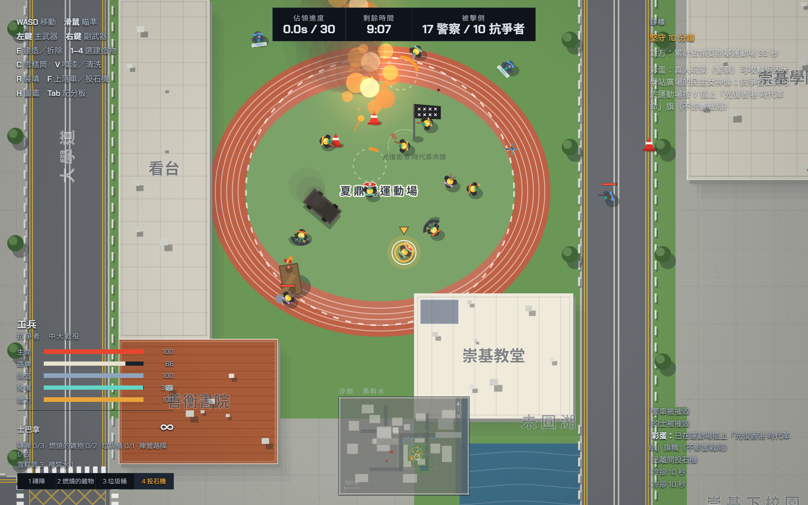
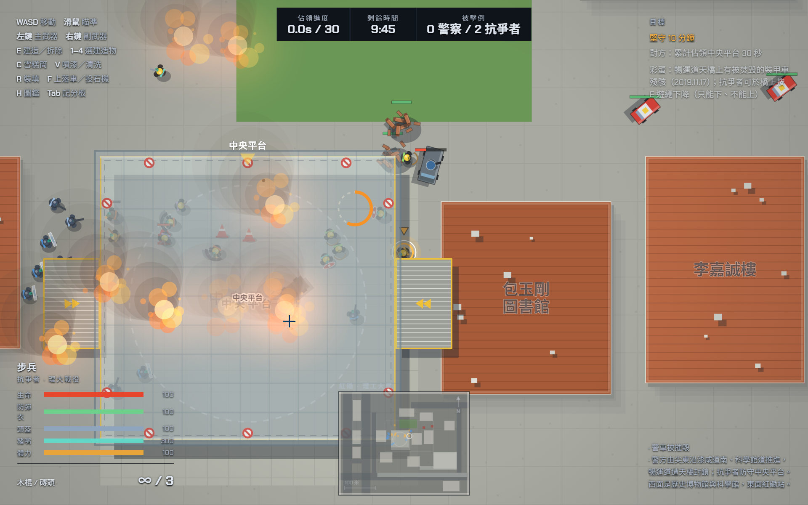
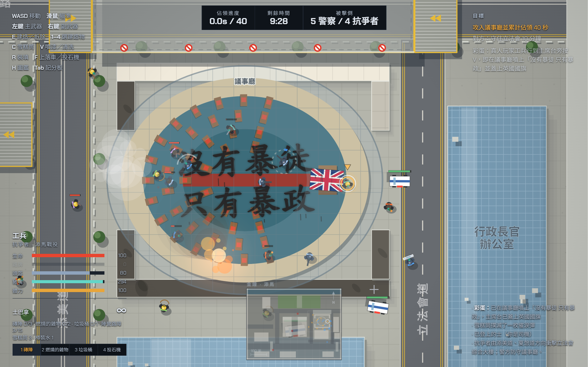
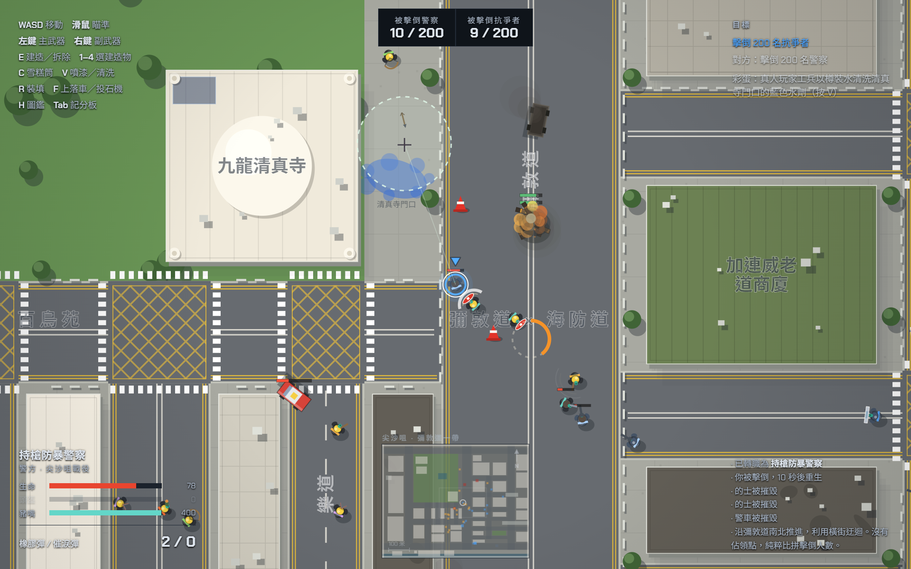

# 2019hk.io — 光復香港 時代革命
#### in memory of Hong Kong, 2019

## 簡介
1
一個俯視角、即時制的小隊戰術原型，以 2019 年香港四個真實地點為戰場重繪：中文大學、理工大學、金鐘添馬、尖沙咀。玩家操控其中一名單位，場上其餘全部由 AI 控制。

整個遊戲只有 一個 HTML 檔（約 5,100 行）：Canvas 2D 繪圖、原生 JavaScript、零框架、零建置流程，執行期間不發任何網絡請求。唯一的外部資源是載入時向 Google Fonts 取的 Chakra Petch——一款拉丁／泰文字體，只影響英文字母與數字；中文無論如何都是由系統字型（PingFang HK／Noto Sans HK／Microsoft JhengHei）渲染。因此離線、或在 Google 服務不通的網絡下都完全正常，只是拉丁字母換成系統字型。

<table> 
  <tr> 
    <td width="50%" align="center">
       <b>中大保衛戰</b> · 夏鼎基運動場
    </td> 
    <td width="50%" align="center">
       <b>理大圍城戰</b> · 中央平台
    </td> 
  </tr> 
  <tr> 
    <td width="50%" align="center">
       <b>71立法會</b> · 議事廳
    </td> 
    <td width="50%" align="center">
       <b>尖沙咀戰役</b> · 九龍清真寺
    </td> 
  </tr> 
</table>

## 為什麼有這個遊戲

以歷史為題材的遊戲很多。二戰、越戰、諾曼第、史太林格勒，有人一遍又一遍地重建。關於 2019 年香港的，寥寥可數。

反送中至今七年。傷口彷彿已經結疤，不少政治犯亦已經出獄，但對全體香港人的傷害一直持續。

維園的燭光，香港人點了三十年。1990 到 2019，每年六月四日，那個硬地足球場都亮起一次。2020 年警方首次不批准，市民仍然自己走進去點起蠟燭——那是最後一次。

當一座城市失去表達的自由，記憶還可以放在哪裡？

遊戲是這個時代的藝術，而任何時代的藝術，都無可避免地或多或少與政治有關。蕭邦二十歲離開波蘭，此後終身未再踏足故土，卻用穿越語言界限的音樂，寫盡對一個自由祖國的想念。一戰期間，一群反戰的藝術家在蘇黎世的伏爾泰酒館發起達達主義，用無厘頭、諷刺與非理性去指控戰爭的荒謬——以最反藝術的方式創作藝術。

至於我：我是一個很容易無聊的人，喜歡試新東西。適逢 AI 崛起，以前又剛好學過一點編程，於是就做了這個。

十五歲那年，我在網上惡搞習近平，香港警察國安處上門抄家，把我帶到警署調查。十六歲，我一個人流亡。不久前，我拿到UC Berkeley的全額獎學金。

這個遊戲不完美，更不是什麼 3A 大作。但如果你在打發時間的時候，偶爾想起 2019 年的香港，那就夠了。如果你身在世界任何一個角落，也希望它能成為一句開場白——讓你有機會跟熱愛民主、自由與社會公義的朋友，講一講香港。

## About

A top-down, real-time squad tactics prototype set across four real Hong Kong locations from 2019: the Chinese University (CUHK), the Polytechnic University (PolyU), Tamar in Admiralty, and Tsim Sha Tsui. You control one unit; everyone else on the field is AI.

The whole game is one HTML file (~5,100 lines): Canvas 2D, vanilla JavaScript, no framework, no build step, and no network calls at runtime. The only external resource is Chakra Petch, fetched from Google Fonts at load — a Latin/Thai typeface that affects only Latin letters and digits; Chinese text is rendered by system fonts (PingFang HK / Noto Sans HK / Microsoft JhengHei) either way. Offline, or on a network where Google is unreachable, everything still works; only the Latin lettering falls back.

## Why this game exists

There are a great many games about history. The Second World War, Vietnam, Normandy, Stalingrad — rebuilt over and over. About Hong Kong in 2019, there are almost none.

Seven years have passed since the anti-extradition movement. The wound looks scabbed over; many political prisoners have served their sentences and walked out. But the injury to Hongkongers has never stopped.

Hong Kong kept the candles lit in Victoria Park for thirty years. From 1990 to 2019, every 4 June, that hard-surface football pitch filled with light. In 2020 the police withheld permission for the first time and people walked in and lit their candles anyway — that was the last of it.

When a city loses the freedom to speak, where can it keep its memory?

Games are the art form of this era, and art in any era is bound up with politics one way or another. Chopin left Poland at twenty and never set foot there again, and spent the rest of his life writing, in a language that needs no translation, about longing for a free homeland. During the First World War, a group of pacifist artists founded Dada at the Cabaret Voltaire in Zurich, indicting the absurdity of the war through nonsense, satire and unreason — making art by the most anti-art means available.

As for me: I get bored easily and I like trying new things. AI happened to arrive, I happened to have learned a little programming, so I made this.

At fifteen I mocked Xi Jinping online. The National Security Department of the Hong Kong Police searched my home and took me to the station for questioning. At sixteen I went into exile, alone. Not long ago I received a full scholarship to UC Berkeley.

This game is not perfect, and it is certainly no AAA title. But if, while you are killing time, you occasionally think of Hong Kong in 2019, that is enough. And wherever in the world you are, I hope it can serve as an opening line — a way to start talking about Hong Kong with friends who care about democracy, freedom and social justice.

> [!NOTE]
> 地點與時序取材自公開報道，戰鬥規則與數值全屬遊戲設計。
> 
> Locations and timelines are drawn from public reporting; the combat rules and numbers are game design.
